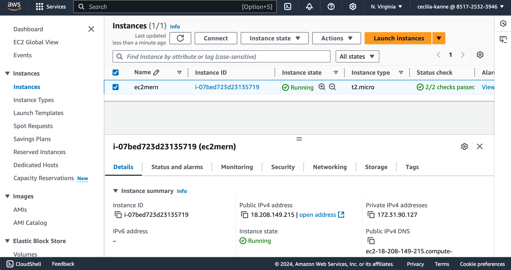

## MEAN Stack implementation
------------------------------------------------------------
### Overview

Hello and welcome! My name is Cecilia, and in this project, I will guide you through the implementation of a **MEAN** stack application. The **MEAN** stack is a powerful and widely used full-stack JavaScript framework consisting of **MongoDB**, **Express.js**, **Angular**, and **Node.js**. This stack enables developers to build dynamic, high-performance web applications entirely in JavaScript across both the client and server sides.


Each component of the MEAN stack plays a crucial role in the development process:

- **MongoDB**: A NoSQL database that stores data in a flexible, JSON-like format.
- **Express.js**: A web application framework for Node.js, providing a robust set of features for building APIs and handling HTTP requests.
- **Angular**: A front-end framework that simplifies the development of single-page applications (SPAs) with dynamic views.
- **Node.js**: A JavaScript runtime that enables server-side scripting, allowing for efficient handling of requests and real-time data processing.

Together, these technologies work seamlessly to create an efficient, scalable, and maintainable web application.

--------------------------------------------------------------------------
### PART 1: Install NodeJs

 **Access the AWS Management Console**
   - Log into AWS Management Console
   - Navigate to EC2 Dashboard
   - Click the "Launch Instance" button
   - Choose Ubuntu Server 24.04 LTS (HVM) from AMI catalog
   - Verify t2.micro Instance Type is selected
   - Create and download an RSA keypair

 **Configure Security Group**
   - Create new security group
   - Add the following inbound rules:

     - Allow traffic on port 80 (HTTP) with source from anywhere on the internet.

     - Allow traffic on port 443 (HTTPS) with source from anywhere on the internet.

     - Allow traffic on port 22 (SSH) with source from any IP address. This is opened by default.

     - Allow traffic on port 3300 (Custom TCP) with source from anywhere.


 **Launch the instance**
   - Review configuration
   - Click "Launch Instance"
   - After launching the instance, verify that the instance status is "running"




**Connect to the EC2 instance via the Terminal using SSH**

- Open the Terminal on your local computer.
- Run the following command to go to the directory (i.e. Downloads) where the `.pem` key pair file was downloaded.

```sh
cd Downloads
```

- Paste the following command to give read permissions to the `.pem` key pair file:

```sh
sudo chmod 400 <private-key-pair-name>.pem
```

- SSH into the EC2 instance using the command shown below:

```sh
ssh -i <private-key-name>.pem ubuntu@<Public-IP-address>
```


**Install Node.JS**

- Update and upgrade Ubuntu

```bash
sudo apt update && sudo apt upgrade -y
```


- Install certifications

```sh
sudo apt -y install curl dirmngr apt-transport-https lsb-release ca-certificates

curl -sL https://deb.nodesource.com/setup_18.x | sudo -E bash -
```


- Install `NodeJS`

```bash
sudo apt-get install -y nodejs
```


--------------------------------------------------------------------------
### PART 2: Install MongoDB

- For this application, Book records were added to MongoDB that contain the following:
    - _Book Name_ 
    - _ISBN number_ 
    - _Author_
    - _Number of Pages_


- Download the MongoDB public GPG key

```bash
curl -fsSL https://pgp.mongodb.com/server-7.0.asc | sudo gpg --dearmor -o /usr/share/keyrings/mongodb-archive-keyring.gpg
```

- Add the MongoDB repository

```bash
echo "deb [ signed-by=/usr/share/keyrings/mongodb-archive-keyring.gpg ] https://repo.mongodb.org/apt/ubuntu jammy/mongodb-org/7.0 multiverse" | sudo tee /etc/apt/sources.list.d/mongodb-org-7.0.list
```

- Update the package database and install MongoDB

```bash
sudo apt-get update
```


```bash
sudo apt-get install -y mongodb-org
```


- Start and enable MongoDB

```bash
sudo systemctl start mongod
```
```bash
sudo systemctl enable mongod
```
```bash
sudo systemctl status mongod
```


- Install body-parser package

The **body-parser** package is needed to help process JSON files passed in requests to the server.

```bash
sudo npm install body-parser
```


- Create the project root folder named `Books`

```bash
mkdir Books && cd Books
```

- Initialize the root folder

```bash
npm init
```

- Press the `Enter` key for each prompt.

- For the prompt, Is this OK? Type `yes`


- Add file named server.js to Books folder

```bash
sudo vim server.js
```
Copy and paste the web server code below into the server.js file.

```bash
const express = require('express');
const bodyParser = require('body-parser');
const mongoose = require('mongoose'); // Make sure mongoose is installed and required
const path = require('path'); // To handle static file serving
const app = express();

// Connect to MongoDB
mongoose.connect('mongodb://localhost:27017/test', { useNewUrlParser: true, useUnifiedTopology: true })
  .then(() => console.log('MongoDB connected'))
  .catch(err => console.error('MongoDB connection error:', err));

// Middleware
app.use(bodyParser.json());
app.use(express.static(path.join(__dirname, 'public')));

// Routes
require('./apps/routes')(app);

// Start the server
app.set('port', 3300);
app.listen(app.get('port'), () => {
  console.log('Server up: http://localhost:' + app.get('port'));
});
```


--------------------------------------------------------------------------
### PART 3: Install Express & set up routes to the server

Express was used to pass book information to and from our MongoDB database.
Mongoose package provides a straightforward schema-based solution to model the application data. Mongoose was used to establish a schema for the database to store data of the book register.

- Install Express and Mongoose

```bash
sudo npm install express mongoose
```


- In `Books` folder, create a folder named `apps`

```bash
mkdir apps && cd apps
```

- In `apps`, create a file named `routes.js`

```bash
vim routes.js
```


- Copy and paste the code below into `routes.js`

```bash
const Book = require('./models/book');
const path = require('path');

module.exports = function(app) {
  // Get all books
  app.get('/book', async (req, res) => {
    try {
      const books = await Book.find({});
      res.json(books);
    } catch (err) {
      console.error(err);
      res.status(500).json({ error: 'Internal Server Error' });
    }
  });

  // Add a new book
  app.post('/book', async (req, res) => {
    try {
      const book = new Book({
        name: req.body.name,
        isbn: req.body.isbn,
        author: req.body.author,
        pages: req.body.pages
      });
      const result = await book.save();
      res.json({
        message: "Successfully added book",
        book: result
      });
    } catch (err) {
      console.error(err);
      res.status(500).json({ error: 'Internal Server Error' });
    }
  });

  // Update a book
  app.put('/book/:isbn', async (req, res) => {
    try {
      const updatedBook = await Book.findOneAndUpdate(
        { isbn: req.params.isbn },
        req.body,
        { new: true }
      );
      if (!updatedBook) {
        return res.status(404).json({ error: 'Book not found' });
      }
      res.json({
        message: "Successfully updated the book",
        book: updatedBook
      });
    } catch (err) {
      console.error(err);
      res.status(500).json({ error: 'Internal Server Error' });
    }
  });

  // Delete a book
  app.delete('/book/:isbn', async (req, res) => {
    try {
      const result = await Book.findOneAndRemove({ isbn: req.params.isbn });
      if (!result) {
        return res.status(404).json({ error: 'Book not found' });
      }
      res.json({
        message: "Successfully deleted the book",
        book: result
      });
    } catch (err) {
      console.error(err);
      res.status(500).json({ error: 'Internal Server Error' });
    }
  });

  // Serve static files
  app.get('*', (req, res) => {
    res.sendFile(path.join(__dirname, '../public', 'index.html'));
  });
};
```


- In the `apps` folder, create a folder named `models`

```bash
mkdir models && cd models
```
- In `models`, create a file named `book.js`

```bash
vim book.js
```


- Copy and paste the code below into `book.js`

```bash
const mongoose = require('mongoose');

const bookSchema = new mongoose.Schema({
  name: { type: String, required: true },
  isbn: { type: String, required: true, unique: true },
  author: { type: String, required: true },
  pages: { type: Number, required: true }
});

module.exports = mongoose.model('Book', bookSchema);
```


--------------------------------------------------------------------------
### PART 4: Access the routes with AngularJS

AngularJS is utilized to connect the web page with Express and perform actions on the book register.

- Change the directory back to `Books` and create a folder named `public`

```bash
cd ../..

mkdir public && cd public
```
- Add a file named script.js into public folder

```bash
vim script.js
```
- Copy and paste the code below (controller configuration defined) into the script.js file.

```bash
var app = angular.module('myApp', []);

app.controller('myCtrl', function($scope, $http) {
  // Get all books
  function getAllBooks() {
    $http({
      method: 'GET',
      url: '/book'
    }).then(function successCallback(response) {
      $scope.books = response.data;
    }, function errorCallback(response) {
      console.log('Error: ' + response.data);
    });
  }

  // Initial load of books
  getAllBooks();

  // Add a new book
  $scope.add_book = function() {
    var body = {
      name: $scope.Name,
      isbn: $scope.Isbn,
      author: $scope.Author,
      pages: $scope.Pages
    };
    $http({
      method: 'POST',
      url: '/book',
      data: body
    }).then(function successCallback(response) {
      console.log(response.data);
      getAllBooks();  // Refresh the book list
      // Clear the input fields
      $scope.Name = '';
      $scope.Isbn = '';
      $scope.Author = '';
      $scope.Pages = '';
    }, function errorCallback(response) {
      console.log('Error: ' + response.data);
    });
  };

  // Update a book
  $scope.update_book = function(book) {
    var body = {
      name: book.name,
      isbn: book.isbn,
      author: book.author,
      pages: book.pages
    };
    $http({
      method: 'PUT',
      url: '/book/' + book.isbn,
      data: body
    }).then(function successCallback(response) {
      console.log(response.data);
      getAllBooks();  // Refresh the book list
    }, function errorCallback(response) {
      console.log('Error: ' + response.data);
    });
  };

  // Delete a book
  $scope.delete_book = function(isbn) {
    $http({
      method: 'DELETE',
      url: '/book/' + isbn
    }).then(function successCallback(response) {
      console.log(response.data);
      getAllBooks();  // Refresh the book list
    }, function errorCallback(response) {
      console.log('Error: ' + response.data);
    });
  };
});
```


- In `public` folder, create a file named `index.html`

```bash
vim index.html
```
- Copy and paste the code below into index.html file

```bash
<!DOCTYPE html>
<html ng-app="myApp" ng-controller="myCtrl">
<head>
  <script src="https://ajax.googleapis.com/ajax/libs/angularjs/1.6.4/angular.min.js"></script>
  <script src="script.js"></script>
  <style>
    /* Add your custom CSS styles here */
  </style>
</head>
<body>
  <div>
    <table>
      <tr>
        <td>Name:</td>
        <td><input type="text" ng-model="Name"></td>
      </tr>
      <tr>
        <td>Isbn:</td>
        <td><input type="text" ng-model="Isbn"></td>
      </tr>
      <tr>
        <td>Author:</td>
        <td><input type="text" ng-model="Author"></td>
      </tr>
      <tr>
        <td>Pages:</td>
        <td><input type="number" ng-model="Pages"></td>
      </tr>
    </table>
    <button ng-click="add_book()">Add</button>
    <div ng-if="successMessage">{{ successMessage }}</div>
    <div ng-if="errorMessage">{{ errorMessage }}</div>
  </div>
  <hr>
  <div>
    <table>
      <tr>
        <th>Name</th>
        <th>Isbn</th>
        <th>Author</th>
        <th>Page</th>
        <th>Action</th>
      </tr>
      <tr ng-repeat="book in books">
        <td>{{ book.name }}</td>
        <td>{{ book.isbn }}</td>
        <td>{{ book.author }}</td>
        <td>{{ book.pages }}</td>
        <td><button ng-click="del_book(book)">Delete</button></td>
      </tr>
    </table>
  </div>
</body>
</html>
```


- Change the directory back up to ‘Books’ and start the server

```bash
cd ..
```

```bash
node server.js
```


The server is now up and running on port 3300! The Book Register web application can now be accessed from the internet with a browser using the `Public IP addres`s or `Public DNS name`.


Add more books to the register!


--------------------------------------------------------------------------
### PART 5: Clean Up!

To avoid incurring future charges, terminate and/or delete all of the resources!

- Terminate the EC2 instance


-------------------------------------------------

### Conclusion

Congratulations! You have successfully completed the project. 

The MEAN stack provides a powerful and cohesive set of technologies for building modern web applications. These technologies allow developers to use JavaScript throughout the entire development process, from front-end to back-end, promoting a unified and streamlined development workflow.

Thank you for viewing my project and following along. I hope you enjoyed it! For more details on similar projects and more, please visit my GitHub portfolio: https://github.com/ceciliacloud


